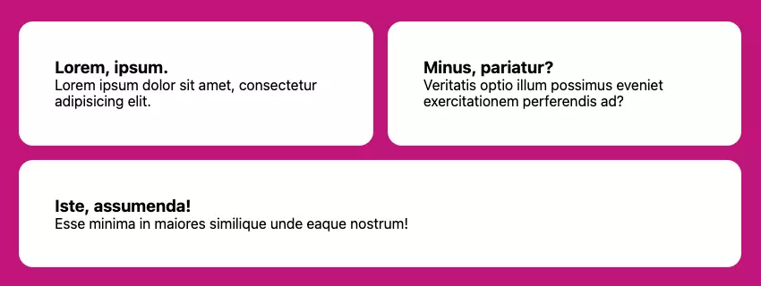

# Responsive CSS Layout Grids không có Media Queries

## Responsive layouts với grid

Đầu tiên có lẽ là giải pháp tôi yêu thích nhất trong số tất cả cấc giải pháp vì tính linh hoạt và dễ sử dụng của nó. Sử dụng Grid, chúng ta có thể tạo một tập hợp các cột đáp ứng để tự tạo khi cần. Chúng tôi sẽ cung cấp một ràng buộc duy nhất - chiều rộng tối thiểu mà các cột có thể có - thực hiện nhiêmj vụ kép như một loại "điểm dừng" trước khi các mục cột chia thành các hàng mới.

Đây là tát cả những gì cần thiết để hoàn thành bố cục grid đáp ứng này, trong đó kích thước cột tối thiểu cảu chúng tôi được đặt thành 30ch thông qua thuộc tính tùy chỉnh cẩu trình trợ giúp. Quy tắc này hướng dẫn trình duyệt tạo bao nhiêu cột có chiều rộng tối thiểu 30ch tùy ý:

    .grid {
    --min: 30ch;

    display: grid;
    grid-template-columns: repeat(auto-fit, minmax(min(100%, var(--min)), 1fr));
    }

Vì 1fr là giá trị "tối đa" cảu minmax() nên các cột cũng được pháp kéo dài để lấp đầy mọi khoảng trống còn lại một cách công bằng trong một hàng. Vì vậy, nếu không gian có sẵn là 80ch và có hai grid con, mỗi gird sẽ chiếm 40ch. Nếu có 3 grid con, đứa thứ ba sẽ ở hàng thứ hai, vì 80 không chia đều cho kích thước tối thiểu cho phép là 30.

Bản demo [CodePen](https://codepen.io/SitePoint/pen/NWOGvvN?editors=1100) sau đây là một ví dụ trực tiếp về bố cục Gird.

## Bố cục đáp ứng với Flexbox

Chúng ta có thể đạt được trải nghiệm tương tự với Flexbox. Sự khác biệt giữa giải pháp Flexbox và Grid là các mục grid chuyển sang một hàng mới không thể mở rộng trên nhiều cột grid. Với Flexbox, chúng ta có thể hướng các mục linh hoạt phát triển để lấp đầy tất cả các khoảng không gian bị thừa còn lại, ngăn chặn tình trạng "mồ côi" xuất hiện với giải pháp grid.

Trong mã này, cũng như trong mã Grid, trình duyệt sẽ tạo bao nhiêu cột vừa với không gian nội tuyến với kích thước --min ít nhất là 30ch. Nếu chúng ta có ba mục và mục thứ ba cần chuyển sang hàng mới, nó sẽ chiếm không gian còn lại do tốc ký flex, điều quan trọng là đặt flex-grow thành 1. Do đó, nó có hành vi tương tự như 1fr trong hầu hết các trường hợp:

    .flexbox-grid {
    --min: 30ch;

    display: flex;
    flex-wrap: wrap;
    }

    .flexbox-grid > * {
    flex: 1 1 var(--min);
    }

Hình ảnh bên dưới hiển thị mục cuối cùng trong danh sách được đánh số lẻ trải dài trên hai cột nhờ thuộc tính flex-grow.

Lưu ý: trong cả giải pháp Grid và Flexbox, nếu chúng ta thêm một [khoảng trống](https://www.sitepoint.com/css-gap-property/), khoảng trống đó sẽ bị trừ đi khi tính toán số lượng cột có thể được tạo trước khi thêm hàng mới.

Những độc giả tinh ý có thể đã nhận thấy một điểm khác biệt quan trọng khác giữa các giải pháp này: khi sử dụng Grid, cha mẹ sẽ xác định hành vi của trẻ. Đối với Flexbox, chúng tôi đặt hành vi bố cục con cho các phần tử con. Các bộ tốc ký `flex`, theo thứ tự, `flex-grow`, `flex-shrink` và `flex-basis`.

Như một thử nghiệm, chúng ta có thể thay đổi giá trị `flex-grow` thành `0` và xem các mục sẽ chỉ mở rộng đến giá trị `flex-basis` như thế nào. (Thử nghiệm với bản demo CodePen bên dưới.) Điều quan trọng là giữ `flex-shrink` thành 1, để cuối cùng — khi không gian nội tuyến có sẵn hẹp hơn `flex-basis` — các mục vẫn được phép “thu nhỏ”, vì điều này sẽ giúp ích để tránh tràn.

Bản [demo CodePen](https://codepen.io/SitePoint/pen/WNaQMeO?editors=1100) sau đây cho thấy cách bố trí Flexbox của chúng tôi đang hoạt động.

Thuộc tính `flex-basis` có thể được điều chỉnh thêm cho giải pháp này để chỉ định các “điểm dừng” duy nhất cho các mục khác nhau. Vì chúng tôi đang đặt giá trị đó thông qua thuộc tính tùy chỉnh `--min` và các phần tử con của Flexbox kiểm soát kích thước của riêng chúng, nên chúng tôi có thể điều chỉnh giá trị đó theo kiểu nội tuyến:

    <li style="--min: 40ch">...</li>

Các phần tử con khác của danh sách trong ví dụ này vẫn sẽ chạy xung quanh nó và sử dụng 30ch từ quy tắc cơ bản, nhưng cột rộng hơn sẽ thay đổi hành vi một cách hiệu quả.

Đây là bản [demo CodePen](https://codepen.io/SitePoint/pen/GRYpQJZ?editors=1100) của mã này đang hoạt động.

Dưới đây là hai kỹ thuật Flexbox khác sử dụng flex-grow và flex-basis theo những cách thú vị:

- [Flexbox Holy Albatross](https://heydonworks.com/article/the-flexbox-holy-albatross-reincarnated/) của Heydon Pickering, được chia nhỏ từ các cột thành một hàng dựa trên tổng chiều rộng của vùng chứa chính.

- [Bố cục thanh bên](https://every-layout.dev/layouts/sidebar/) của Heydon Pickering và Andy Bell, cho thấy cách buộc các điểm dừng khác nhau dựa trên Flexbox để kiểm soát tốt hơn thời điểm gói các mục.

Bài viết này được trích từ [Giải phóng sức mạnh của CSS: Kỹ thuật nâng cao cho giao diện người dùng đáp ứng](https://www.sitepoint.com/premium/books/unleashing-the-power-of-css/), có sẵn trên SitePoint Premium.

## Câu hỏi thường gặp (FAQ) về Grids Layout CSS đáp ứng

## Sự khác biệt giữa Grid CSS và Flexbox là gì?

CSS Grid và Flexbox đều là những hệ thống bố cục mạnh mẽ trong CSS. Mặc dù chúng có thể được sử dụng cùng nhau nhưng mỗi loại đều có điểm mạnh riêng. CSS Grid là một hệ thống hai chiều, nghĩa là nó có thể xử lý cả cột và hàng, khiến nó trở nên lý tưởng cho bố cục trang web. Mặt khác, Flexbox là mô hình bố cục một chiều và được sử dụng để thiết kế bố cục quy mô nhỏ, trong khi grid CSS dành cho bố cục quy mô lớn hơn.

## Làm cách nào tôi có thể tạo bố cục đáp ứng mà không cần sử dụng truy vấn phương tiện?

Bạn có thể tạo bố cục đáp ứng mà không cần sử dụng truy vấn phương tiện bằng cách sử dụng CSS Grid hoặc Flexbox. Các hệ thống bố cục này cho phép bạn tạo bố cục linh hoạt thích ứng với các kích thước màn hình khác nhau. Ví dụ: với CSS Grid, bạn có thể sử dụng đơn vị 'fr' để tạo các rãnh lưới linh hoạt có thể thay đổi kích thước dựa trên không gian có sẵn.

## Đơn vị 'fr' hoạt động như thế nào trong CSS Grid?

Đơn vị ‘fr’ trong CSS Grid là viết tắt của ‘phân số’. Nó đại diện cho một phần không gian có sẵn trong vùng chứa lưới. Ví dụ: nếu bạn có một grid có hai cột và bạn đặt chiều rộng của một cột thành 1fr và cột kia thành 2fr thì cột đầu tiên sẽ chiếm một phần ba không gian có sẵn và cột thứ hai sẽ chiếm hai phần ba không gian có sẵn. 

## Tôi có thể sử dụng CSS Grid và Flexbox cùng nhau không?

Có, CSS Grid và Flexbox có thể được sử dụng cùng nhau. Bạn có thể sử dụng CSS Grid để bố trí cấu trúc tổng thể của trang, sau đó sử dụng Flexbox bên trong các mục grid để bố trí nội dung của chúng. Điều này cho phép bạn tận dụng được điểm mạnh của cả hai hệ thống bố trí.

## Làm cách nào tôi có thể căn chỉnh các mục trong vùng chứa Flexbox?

Bạn có thể căn chỉnh các mục trong vùng chứa Flexbox bằng thuộc tính 'align-items'. Thuộc tính này chấp nhận một số giá trị, bao gồm 'flex-start', 'flex-end', 'center', 'baseline' và 'stretch'. Ví dụ: 'align-items: center' sẽ căn chỉnh các mục theo chiều dọc ở giữa vùng chứa.

## Sự khác biệt giữa 'justify-content' và 'align-items' trong Flexbox là gì?

Trong Flexbox, 'justify-content' được sử dụng để căn chỉnh các mục dọc theo trục chính (theo chiều ngang nếu 'flex-direction' là 'hàng', theo chiều dọc nếu 'flex-direction' là 'column'), trong khi 'align-items' là dùng để căn chỉnh các mục dọc theo trục chéo (vuông góc với trục chính).

## Làm cách nào tôi có thể tạo grid với các cột có chiều rộng bằng nhau trong CSS Grid?

Bạn có thể tạo lưới với các cột có chiều rộng bằng nhau trong CSS Grid bằng cách đặt thuộc tính 'grid-template-columns' thành một chuỗi giá trị '1fr'. Ví dụ: 'grid-template-columns: 1fr 1fr 1fr' sẽ tạo một lưới có ba cột có chiều rộng bằng nhau.

## Làm cách nào tôi có thể làm cho vùng chứa Flexbox có thể cuộn được?

Bạn có thể làm cho vùng chứa Flexbox có thể cuộn được bằng cách đặt thuộc tính 'overflow' thành 'tự động' hoặc 'cuộn'. Điều này sẽ thêm thanh cuộn vào vùng chứa nếu nội dung vượt quá giới hạn của vùng chứa.

## Tôi có thể sử dụng CSS Grid và Flexbox trên tất cả các trình duyệt không?

CSS Grid và Flexbox được hỗ trợ trong tất cả các trình duyệt hiện đại, bao gồm Chrome, Firefox, Safari và Edge. Tuy nhiên, chúng không được hỗ trợ trong Internet Explorer 10 trở về trước. Bạn có thể sử dụng các công cụ như Autoprefixer để thêm tiền tố cần thiết của nhà cung cấp để tương thích với trình duyệt tốt hơn.

## Làm cách nào tôi có thể tìm hiểu thêm về CSS Grid và Flexbox?

Có rất nhiều tài nguyên trực tuyến để tìm hiểu về CSS Grid và Flexbox. Mạng lưới nhà phát triển Mozilla (MDN) có hướng dẫn toàn diện về cả CSS Grid và Flexbox. Bạn cũng có thể tìm thấy hướng dẫn trên các trang web như CSS-Tricks và các khóa học trên các nền tảng như Codecademy và Udemy.